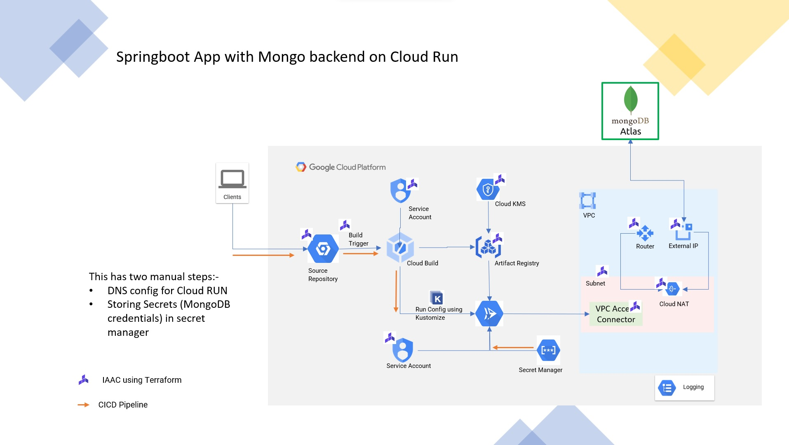

## Local Execution
This is code for java springboot microservcies with mongodb as backend.

The data required is sample mysql database - [here](https://www.mysqltutorial.org/mysql-sample-database.aspx#:~:text=%20The%20MySQL%20sample%20database%20schema%20consists%20of,such%20as%20who%20reports%20to%20whom.%20More%20)
* You need to import this database to mysql first (as per instructions in the link)
* Export the tables - customer order and orderdetails as CSV
* Import these tables to mongo instance

This needs environment variable,  SPRING_DATA_MONGODB_URI set. Code does not accept separate user/password. These needs to be part of URI.

## Cloud Run execution
To run this on GCP Cloud Run, associated infrastructure needs to bve created. Terraform template for the same is provided [here](https://github.com/skamalj/gcp-terraform/tree/master/stacks/cloudrun_project)

The setup created by this template is described in image below.  Components which are created by terraform are highlighted with TF logo.
